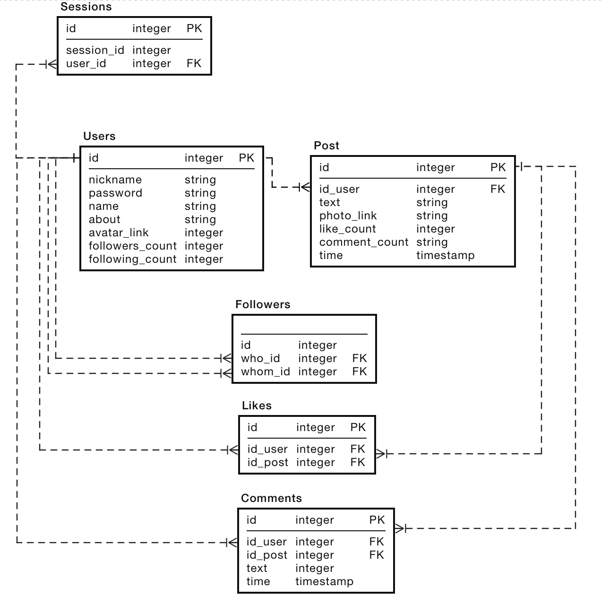

# TP_HL_Course_Work
Проектирование веб-сервиса HighLoad (третий семестр)

# Instagram
# MVP
1. Авторизация/регистрация
2. Публикация фотографий
3. Просмотр ленты
4. Лайки/комментарии
5. Подписка

# 1. Целевая аудитория
- 1 млрд. людей использует Instagram ежемесячно[1]
- 63% (630 млн.) пользователей Instagram заходят в сеть, по крайней мере, один раз в день. 42% (420 млн.) делают это несколько раз в день[2].
- 95 млн. публикаций фотографий в день
- Местоположение подавляющего большинства целевой аудитории[3]: 
  - Северная Америка 
    - США ~ 120 млн./месяц
    -  Мексика ~ 22 млн./месяц
  - Евразия 
    - Индия ~ 75 млн./месяц
    - Индонезия ~ 62 млн./месяц
    - Турция ~ 38 млн./месяц
    - Россия ~ 37 млн./месяц
    - Япония ~ 27 млн./месяц
    - Великобритания ~ 24 млн./месяц
    - Германия ~ 20 млн./месяц
  - Южная Америка 
    - Бразилия ~ 69 млн./месяц

# 2. Расчет нагрузки
## Продуктовые метрики
Из анализа целевой аудитории делается вывод, что:
- 1 млрд. - месячная аудитория сервиса[1].
- Примерно на пользователя приходится ~ 100 фотографий. Данные были взяты из анализа количества фотографий своих подписчиков в Instagram.
- Опубликовав фото с размером 559 Кб. Затем сохранил эту фотографию из Instagram с размером 158 Кб. Фотография уменьшила свой размер в 3,5 раза. => Средний размер хранилища пользователя примерно равен 15,4 Мб. (Если брать примерный размер фото в 158 Кб.)
- У 90% пользователей есть аватарка профиля. Возьмем изображение в размере 200х200. В среднем вес аватраки - 5 Кб.
- У каждой фотографии есть миниатюра для отображения в коллекции профиля. Изображения будут формата 1:1 и весить в 3 раза меньше. => 52 Кб.
- Средний общий размер хранилища одного пользователя равен 20,9 Мб.
- Среднее количество действий пользователя по типам в день:
  - Возьмем 420 млн. активных пользователей в день. Делим на 95 млн. публикаций в день. Получим ~ 4 фотографии пользователь публикует в день.
  - 4.2 млрд. лайков ежедневно[1]. Возьмем 630 млн. активных пользователей в день, кто оставляет лайк. Получим ~ 6 лайков в день на одного пользователя.
  - Предположим, что комментариев оставляют в 100 раз реже, чем лаки. ~ 42 млн. комментариев в день. Возьмем 420 млн. активных пользователей в день. Получим ~ 0,1 комментариев в день на одного пользователя.
  - 347 тыс. скороллов ленты в минуту[4]. Один скролл = 1 фотографии. 500 млн публикаций в день. Возьмем 420 млн. активных пользователей в день. И получим ~ 1,2 просмотров фотографий в день пользователем. 
  - Просмотр профиля исходя из моих наблюдений происходит 5 раз в день.
  - За месяц пользователь +- может подписаться на 5 аккаунтов. => 0,16 подписок в день.
  - За месяц пользователь +- может отписаться от 2 аккаунтов. => 0,07 отписок в день.
- По статистике за 2019 год число пользователей составляло 1,2 млрд., за 2020 год цифра составила 1,5 млрд. За год прирост на 300 млн. новых пользователей. Получим ~ 821 тыс. новых пользователей в день. Число повторных авторизаций примерно поделим в 3 раза. Получим ~ 273 тыс.

## Технические метрики
- Если предположить, что аудитория 1,5 млрд. и ~ 100 фотографий на каждом профиле + миниатюры + аватарка, то получаем 21,5 Пб + 7 Пб + 6,9 Тб = 28,5 Пб + 6,9 Тб.
- Сетевой трафик:
  - Существенным типом трафика является загрузка фотографий. Фотография уже отправляется в ужатом состояние. 95 млн. фото на 158 Кб. за день => Передаётся ~ 168 Мб/с
  - Существенным типом трафика является получение фотографий. 500 млн. за день => Передаётся ~ 871 Мб/с
  - Существенным типом трафика является получение миниатюр для сетки профиля. Пользователь при посещении профиля видит ~ 8 миниатюр. 8 * 5 * 420 млн. активных пользователей в день. = 16,8 млрд миниатюр за день => Передаётся ~ 9,6 Гб/с

- RPS:
  - Публикация фото: 95 млн. в день => 1100 RPS
  - Лайки: 4.2 млрд. в день => 48600 RPS
  - Комментарии: 42 млн. в день => 486 RPS
  - Просмотр ленты: 500 млн. в день => 5787 RPS
  - Регистрация: 821 тыс. в день => 10 RPS
  - Авторизация: 273 тыс. в день => 3 RPS
  - Просмотр профиля: 2.1 млрд. в день => 24 305 RPS
  - Подписки: 67,2 млн. в день => 777 RPS
  - Отписки: 29,4 млн. в день => 340 RPS

# 3. Логическая схема

# 4. Физическая схема
Такие таблицы как, Users и Post будут храниться в PostgreSQL за счёт своей надежности, стабильности, удобный шардинг и репликация[5]. Для Users.id, Post.id, Post.id_user устанавливаем Hash индекс, так как 99% запросов будет только с оператором равно. Для поля Post.time устанавливаем b_tree индекс. 
В таблице Users и Post сразу указываются количество подписок, подписчиков, лайков и комментариев, чтоб не вычислять их при каждом запросе. Будет использоваться шардинг и репликация совместно. Это позволит снизить нагрузку на чтение данных + отказоустойчивость. При таком количестве пользователей и геоиспользовании нужно будет держать данные консистентными. Для Post и Users по полю Users.id и Post.id_user. Конечный пунктом является результат хэш-функции от числа инстансов.

Для остальных таблиц логической схемы будет использоваться Tarantool с быстрым доступом к данным, с возможностью шаридирования VShard[6] и репликацией. 
Для шардирования мы можем выбрать колоссальное количество bucket’ов, десятки и сотни тысяч. Главное, чтобы их было хотя на два порядка больше, чем максимальное количество replica set-ов, которое у нас когда-либо будет в кластере. Следовательно, к таблицам Sessions, Followers, Likes, Comments добавляется поле bucket_id.

# 5. Технологии
Instagram считается мобильным приложением, хоть есть и веб версия. В рамках MVP сделаем упор исключительно на мобильное приложение. 

## Клиентское приложение
  Android(Kotlin), IOS(Swift) приложение. Разработка приложений освобождает от постоянной загрузки html, js, css файлов и прочего, что снижает нагрузку на проект.
## Backend
  Для данного проекта будет использоваться "Микросервисная архитектура". Критериями выбора стали те факторы, что она позволяет повысить надежность, гибкость, хорошо масштабируемая архитектура. Микросервисная архитектура позволяет писать различные микросервисы на разных ЯП, что может пригодиться в разработке. Общение между сервисами будет происходить с помощью gRPC + Protobuf. Protobuf очень быстро выполняет сериализацию на сервере и клиенте. Сериализация Protobuf приводит к небольшому объему полезных данных сообщения, а это важно в сценариях с ограниченной пропускной способностью, например для мобильных приложений.
gRPC предназначен для протокола HTTP/2, основной версии HTTP, которая обеспечивает значительное повышение производительности по сравнению с HTTP 1.x [7]
Как упоминалось ранее можно использовать любой язык программирования в зависимости от потребностей. Однако основным языком программирования является GoLang. За счёт своей простоты, производительности, количеством библиотек.
## Балансировка 
 В первую очередь DNS-балансировщик (Geo-based DNS). Из-за востребованности сервиса по всему миру, пользователь должен ходить на ближайший к нему дата-центр.  
 На L7 используется Ngnix, позволяющая решить проблему медленных клиентов.
 ## Итого, стек технологий 
  - Android app (Kotlin)
  - IOS app (Swift)
  - Микросервисная архитектура
  - gRPC + Protobuf
  - HTTP/2
  - GoLang + Языки по необходимости
  - Geo-based DNS
  - Ngnix
  - PSQL
  - Tarantool
  
# 6. Схема проекта

DNS Geo - Пользователь ходит на ближайший к нему дата-центр. Предположим, что у нас два дата-центра. Один в Лос-Анджелисе, другой во Франкфурт.
L7(Ngnix) - балансирует трафик между определенной группой сервисов.

 ## Взаимодействие сервисов
 ### Создание аккаунта
 1. Profile - создание аккаунта
 2. Auth - выдача сессии
 
 ### Вход в аккаунт
 1. Profile - создание аккаунта
 2. Auth - выдача сессии

 ### Создание поста
 1. Auth - проверка сессии
 2. Posts - Создание поста
 3. Profile - Увеличение счетчика постов
 4. Images - Загрузка изображения

 ### Просмотр профиля
 1. Profile - Информация о профиле
 2. Posts - Получение постов
 3. Images - выдача аватарки и постов

 ### Просмотр комментариев
 1. Comments - выдача комментариев к посту

 ### Оставить комментарий
 1. Auth - проверка сессии
 2. Comments - добавление комменатрия
 3. Posts - Увеличение счетчика комментариев

 ### Подписаться
 1. Auth - проверка сессии
 2. Followers - добавление подписки
 3. Profile - Увеличение счетчика подписок

 ### Отподписаться
 1. Auth - проверка сессии
 2. Followers - удаление подписки
 3. Profile - Уменьшение счетчика подписок

 ### Просмотр поста
 1. Posts - получение данных к посту
 2. Images - Получение картинки

# 7. Список серверов
Количество умножается на 2. Так как отдельно для Америки и европы.

## NGNIX 
Ngnix получает 82 508 RPS. NGNIX с 16 CPU позволяет обрабатывать около 6 600 CPS через HTTPS[8]. Количество SSD тут не важно. 10 Гб/с трафика в секунду:

CPU(cores)    | RAM (Gb)      |SSD (Gb)| Network (Gbps)|Количество|
------------- | ------------- |--------|---------------|----------|
16            | 32            |128     |10             |26 +  13 разервных |

## Базы данных 
Большее количество запросов идет на базу Session. +- в день 500 млн, если размер одной сессии 2 Кб => 953 Гб. Если RAM 64, то получается 14 шардов. Tarantool нагружает CPU. 51 000 RPS. 2 Кб  * 51 000 RPS = 100 Мб/с Сетевая карта

 ### Sessoin
CPU(cores)    | RAM (Gb)      |SSD (Gb)| Network (Mbps)|Количество|
------------- | ------------- |--------|---------------|----------|
32            | 64            |128     |100            |28 +  28 реплик |

По такому прицнипу расчитываем и для дргуих баз данных
 
 ### Followers
  CPU(cores)  | RAM (Gb)      |SSD (Gb)| Network (Mbps)|Количество|
------------- | ------------- |--------|---------------|----------|
16            | 16            |128     |100            |16 +  16 реплик |
 
 ### Comments
  CPU(cores)  | RAM (Gb)      |SSD (Gb)| Network (Mbps)|Количество|
------------- | ------------- |--------|---------------|----------|
16            | 16            |128     |1000           |16 +  16 реплик |

 ### Likes
  CPU(cores)  | RAM (Gb)      |SSD (Tb)| Network (Mbps)|Количество|
------------- | ------------- |--------|---------------|----------|
16            | 16            |2       |100            |140 +  140 реплик |

 ### Posts
  CPU(cores)  | RAM (Gb)      |SSD (Tb)| Network (Gbps)|Количество|
------------- | ------------- |--------|---------------|----------|
16            | 32            |4       |10             |349 +  349 реплик |

 ### Profile
  CPU(cores)  | RAM (Gb)      |SSD (Tb)| Network (Gbps)|Количество|
------------- | ------------- |--------|---------------|----------|
16            | 16            |4       |10             |178 +  178 реплик |

## Сервисы
### Auth
CPU(cores)    | RAM (Gb)      |SSD (Gb)| Network (Mbps)|Количество|
------------- | ------------- |--------|---------------|----------|
16            | 32            |128     |100            |8 +  8 разервных |
 
 ### Followers
  CPU(cores)  | RAM (Gb)      |SSD (Gb)| Network (Mbps)|Количество|
------------- | ------------- |--------|---------------|----------|
4             | 32            |128     |100            |2 + 2 разервных |
 
 ### Comments
  CPU(cores)  | RAM (Gb)      |SSD (Gb)| Network (Mbps)|Количество|
------------- | ------------- |--------|---------------|----------|
4             | 32            |128     |1000           |2 + 2 разервных |

 ### Likes
  CPU(cores)  | RAM (Gb)      |SSD (Gb)| Network (Mbps)|Количество|
------------- | ------------- |--------|---------------|----------|
16            | 32            |128     |100            |6 +  6 разервных |

 ### Posts
  CPU(cores)  | RAM (Gb)      |SSD (Gb)| Network (Gbps)|Количество|
------------- | ------------- |--------|---------------|----------|
16            | 32            |128       |10           |2 +  2 разервных |

 ### Profile
  CPU(cores)  | RAM (Gb)      |SSD (Gb)| Network (Gbps)|Количество|
------------- | ------------- |--------|---------------|----------|
16            | 32            |128     |10             |2 +  2 разервных |

# Список используемых источников 
1. https://www.websiterating.com/ru/research/instagram-statistics/#chapter-1
2. https://www.likeni.ru/analytics/statistika-po-instagram-kotoruyu-nuzhno-znat-k-2020-godu/
3. https://lpgenerator.ru/blog/2019/02/28/instagram-v-cifrah-statistika-na-2019-god/
4. https://blog.ingate.ru/detail/instagram-v-tsifrakh-i-faktakh-aktualnaya-statistika-2019/
5. https://habr.com/ru/post/348220/
6. https://habr.com/ru/company/vk/blog/436916/
7. https://docs.microsoft.com/ru-ru/aspnet/core/grpc/comparison?view=aspnetcore-5.0
8. https://www.nginx.com/blog/testing-the-performance-of-nginx-and-nginx-plus-web-servers/

